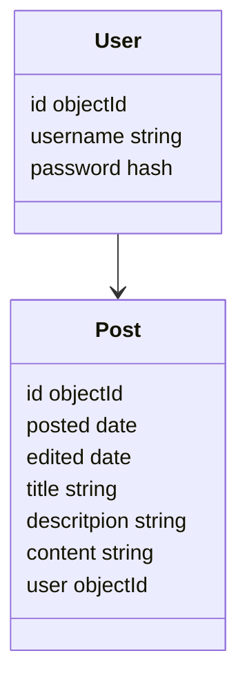

# Express Blog API

This is a part of an assignment from The Odin Project (top).
The assignment was to build a backend API with two different front-ends, on for the end-user (blog reader) and one for the admin (the blog writer).

This specific repository is for the backend API. Here are the repositories for the tw front ends:
[End User Front-end](https://github.com/aslanhudajev/express-blog-front)
[Administrator Front-end](https://github.com/aslanhudajev/express-blog-dashboard)

## Built with

- Express JS
- MongoDB (_Mongoose_)
- Passport (_passport-jwt_)
- JWT
- Bcrypt
- Express validator

## Features

A server that serves a RESTful API with two different main route paths: `/blog` (unprotected path for end user front-end) and `/dashboard` (protected path for administrator front-end).

This API features the following functions for the two main paths:

### `/blog`

- Path to get all published posts
  - `GET /api/blog/posts`
- Path to get one specific post
  - `GET /api/blog/post/:postId`

### `/dashboard`

- Path to sign in (unprotected)
  - `POST /api/dashboard/signin`
- path to sign out (unprotected)
  - `POST /api/dashboard/signout`
- Path to get all published and draft posts
  - `GET /api/dashboard/posts`
- Path to get one specific post
  - `GET /api/dashboard/post/:postId`
- Path to create new post
  - `POST /api/dashboard/new-post`
- Path to edit specific post
  - `POST /api/dashboard/edit/:postId`
- Path to change password
  - `POST /api/dashboard/edit/password`
- Path to delete specific post
  - `POST /api/dashboard/delete/:postId`

## Models

